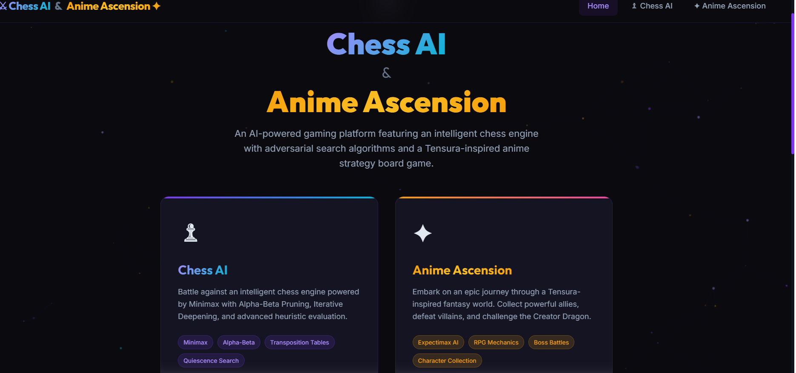
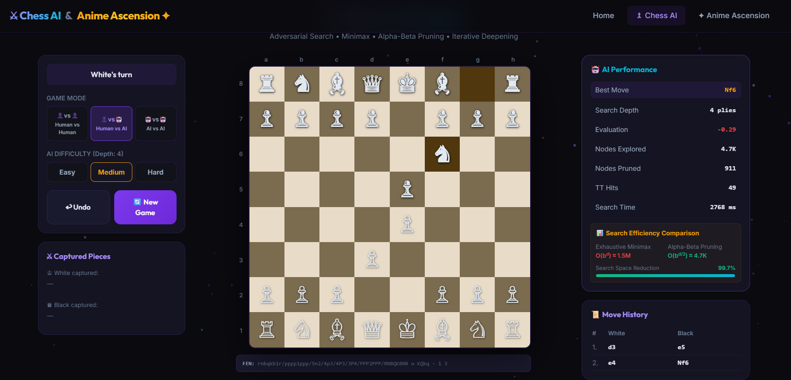
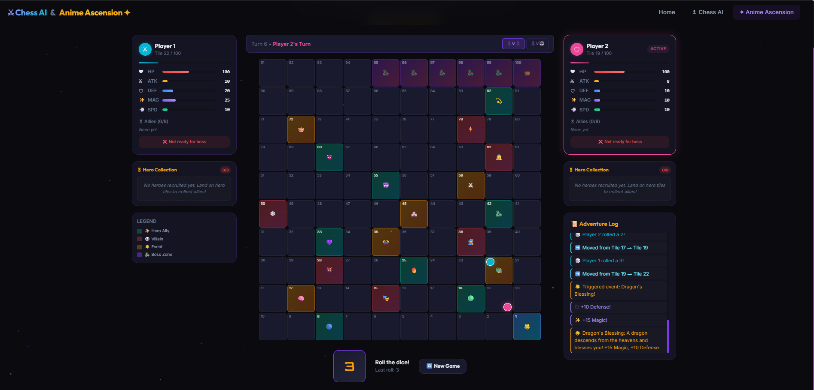

# ♟ Chess AI & Anime Ascension ✦

> An AI-powered gaming platform featuring an intelligent chess engine and a Tensura-inspired anime strategy board game.


## 🎮 Games

### ♟ Chess AI Engine
A fully functional chess engine implementing:
- **Minimax Algorithm** with **Alpha-Beta Pruning**
- **Iterative Deepening Search**
- **Transposition Tables** (Zobrist Hashing)
- **Quiescence Search** (captures at leaf nodes)
- **Opening Book** (Sicilian, Italian, Ruy Lopez, QGD, King's Indian)
- **Advanced Heuristic Evaluation**:
  - Material counting (standard piece values)
  - Piece-Square Tables for all 6 piece types
  - King Safety (castling, pawn shield, open files)
  - Mobility (legal moves, center control)
  - Piece Activity (bishop pair, rook files, passed pawns)
- **Real-time AI Statistics** panel showing nodes, pruning, search time
- **3 Game Modes**: Human vs Human, Human vs AI, AI vs AI
- **3 Difficulty Levels**: Easy (depth 2), Medium (depth 4), Hard (depth 6)

### ✦ Anime Ascension
A Tensura-inspired strategy board game with:
- **100-tile fantasy board** with snake-path progression
- **8 Hero Allies**: Rimuru, Diablo, Veldora, Guy Crimson, Shion, Gobta, Benimaru, Milim Nava
- **6 Villains**: Michael, Feldway, Orc Lord, Clayman, Velzard, Jahil
- **6 Special Events**: Demon Lord Awakening, Harvest Festival, Dragon's Blessing, etc.
- **RPG Stat System**: HP, ATK, DEF, MAG, SPD
- **Final Boss Battle** against Veldanava with collection requirements
- **Expectimax AI** for strategic board game decision-making

# Home Page



# Chess



# Tensura Game



# Character Discription


## 🏗 Tech Stack

| Layer | Technology |
|-------|-----------|
| Frontend | React 19 + TypeScript + Tailwind CSS v4 + Motion |
| Backend | Python + FastAPI |
| AI Engine | Minimax, Alpha-Beta, Expectimax |
| Database | SQLite (planned) |
| Chess Logic | python-chess |

## 🚀 Quick Start

### Prerequisites
- **Node.js** 18+
- **Python** 3.10+

### Backend Setup
```bash
cd backend
pip install -r requirements.txt
uvicorn app.main:app --reload --port 8000
```

### Frontend Setup
```bash
cd frontend
npm install
npm run dev
```

The app will be available at **http://localhost:5173**

## 📊 AI Concepts Demonstrated

| Concept | Implementation |
|---------|---------------|
| Adversarial Search | Minimax Algorithm |
| Optimization | Alpha-Beta Pruning |
| Heuristic Evaluation | Multi-factor position scoring |
| Game Theory | Strategic decision making |
| Probabilistic AI | Expectimax for dice-based games |
| Caching | Transposition Tables (Zobrist) |
| Search Extensions | Quiescence Search, Iterative Deepening |

## 📁 Project Structure

```
Games_Project/
├── frontend/              # React + TypeScript SPA
│   ├── src/
│   │   ├── features/
│   │   │   ├── chess/     # Chess game (board, hooks, components)
│   │   │   └── anime/     # Anime Ascension (board, hooks, data)
│   │   ├── components/    # Shared UI (Navigation, Particles)
│   │   └── pages/         # Home page
│   └── ...
├── backend/               # Python FastAPI server
│   └── app/
│       ├── api/           # REST API routes
│       ├── engine/        # AI engines (chess, anime)
│       ├── models/        # Database models
│       └── schemas/       # Pydantic schemas
└── docs/                  # Documentation
```

## 📜 License

This project is built as a final-year Computer Science AI project for academic purposes.
"# Chess_Anime_AscensionGame" 
