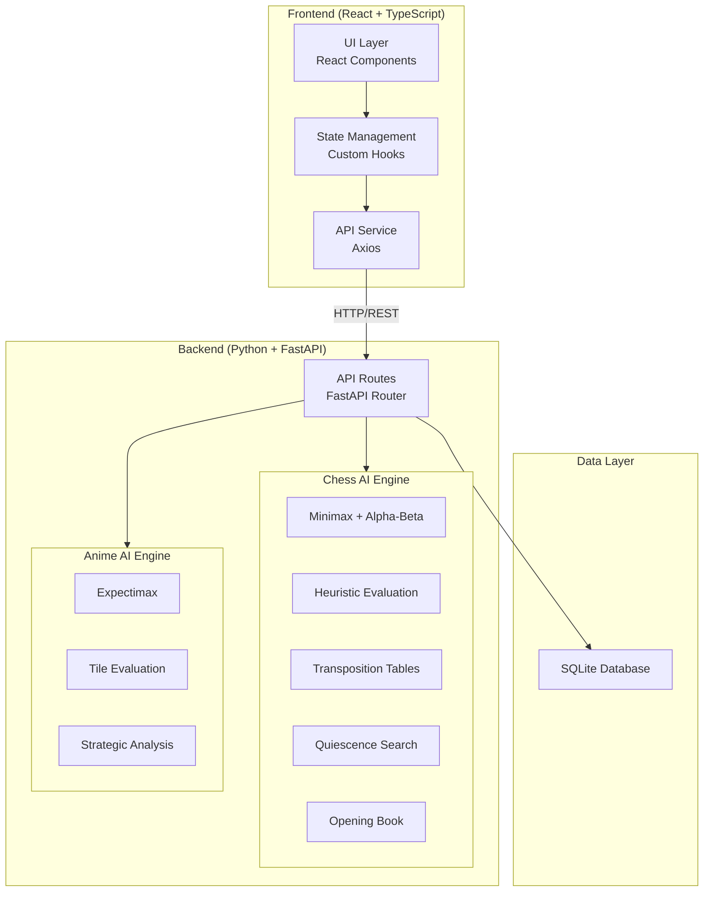
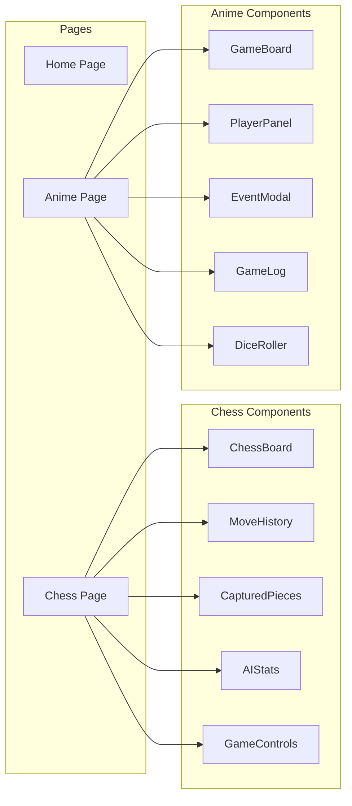
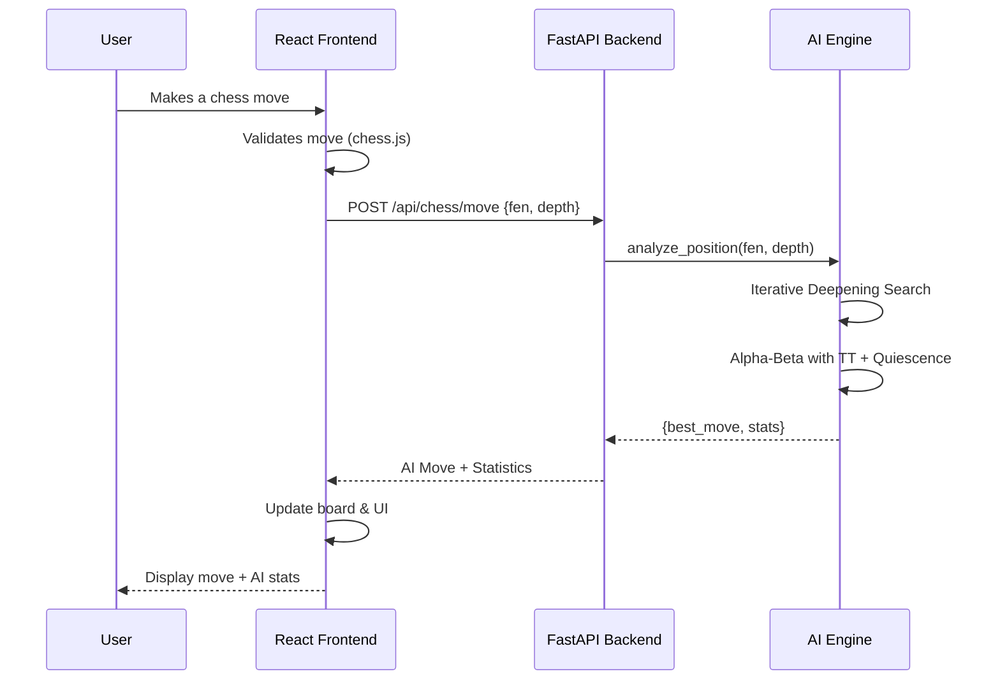

# System Architecture

## Overview

The Chess AI & Anime Ascension platform follows a clean **client-server architecture** with a React frontend and Python FastAPI backend.

## Architecture Diagram

## Component Architecture

## Data Flow

## Technology Decisions

| Decision | Choice | Rationale |
|----------|--------|-----------|
| Frontend Framework | React + TypeScript | Type safety, component model, ecosystem |
| Build Tool | Vite | Fast HMR, modern ESM support |
| Styling | Tailwind CSS v4 | Utility-first, rapid prototyping |
| Animations | Motion (Framer Motion) | Declarative animations, layout animations |
| Backend | FastAPI | Async, auto-docs, Pydantic validation |
| Chess Logic (Backend) | python-chess | Production-grade move generation |
| Chess Logic (Frontend) | chess.js | Client-side validation |
| AI Algorithms | Custom implementation | Educational purpose, full control |
