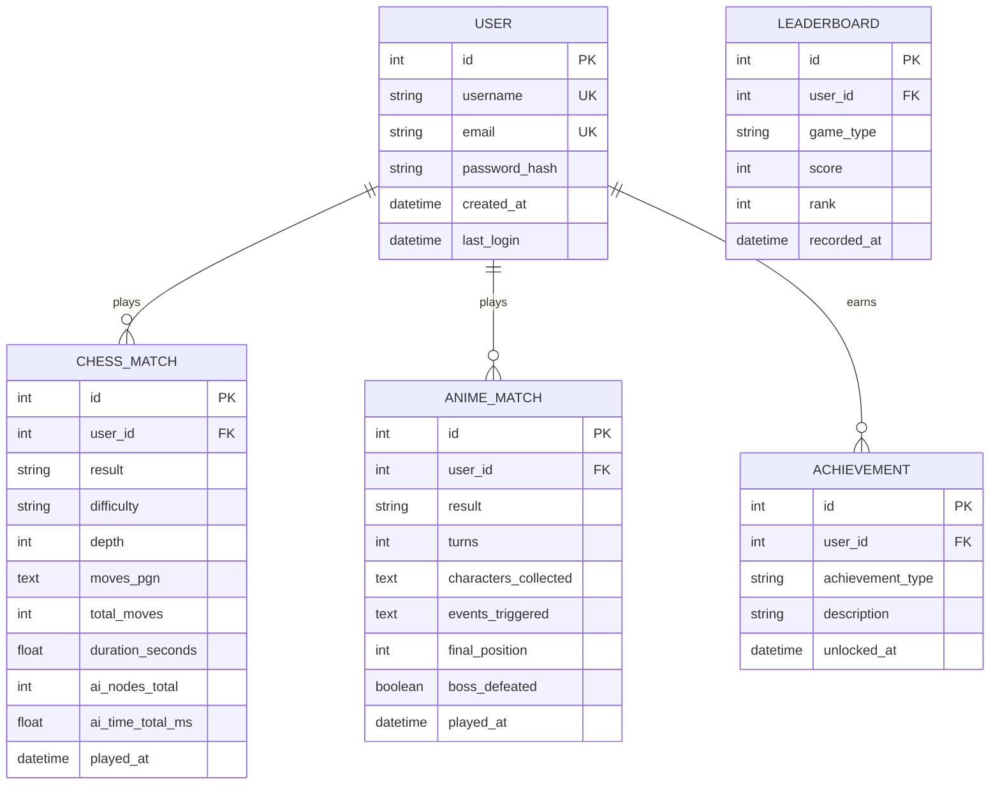

# Database Schema

## Overview

The application uses **SQLite** for data persistence. This document describes the planned database schema.

## Entity Relationship Diagram

## Tables

### users
| Column | Type | Constraints |
|--------|------|------------|
| id | INTEGER | PRIMARY KEY, AUTOINCREMENT |
| username | VARCHAR(50) | UNIQUE, NOT NULL |
| email | VARCHAR(100) | UNIQUE, NOT NULL |
| password_hash | VARCHAR(255) | NOT NULL |
| created_at | TIMESTAMP | DEFAULT CURRENT_TIMESTAMP |
| last_login | TIMESTAMP | NULLABLE |

### chess_matches
| Column | Type | Constraints |
|--------|------|------------|
| id | INTEGER | PRIMARY KEY, AUTOINCREMENT |
| user_id | INTEGER | FOREIGN KEY → users(id) |
| result | VARCHAR(10) | 'win', 'loss', 'draw' |
| difficulty | VARCHAR(10) | 'easy', 'medium', 'hard' |
| depth | INTEGER | AI search depth used |
| moves_pgn | TEXT | Full game in PGN format |
| total_moves | INTEGER | Number of moves |
| duration_seconds | FLOAT | Game duration |
| ai_nodes_total | INTEGER | Total AI nodes explored |
| ai_time_total_ms | FLOAT | Total AI thinking time |
| played_at | TIMESTAMP | DEFAULT CURRENT_TIMESTAMP |

### anime_matches
| Column | Type | Constraints |
|--------|------|------------|
| id | INTEGER | PRIMARY KEY, AUTOINCREMENT |
| user_id | INTEGER | FOREIGN KEY → users(id) |
| result | VARCHAR(10) | 'victory', 'defeat' |
| turns | INTEGER | Total turns played |
| characters_collected | TEXT | JSON array of heroes collected |
| events_triggered | TEXT | JSON array of events |
| final_position | INTEGER | Final tile position |
| boss_defeated | BOOLEAN | Whether boss was defeated |
| played_at | TIMESTAMP | DEFAULT CURRENT_TIMESTAMP |

### achievements
| Column | Type | Constraints |
|--------|------|------------|
| id | INTEGER | PRIMARY KEY, AUTOINCREMENT |
| user_id | INTEGER | FOREIGN KEY → users(id) |
| achievement_type | VARCHAR(50) | e.g., 'first_win', 'speed_demon' |
| description | VARCHAR(200) | Human-readable description |
| unlocked_at | TIMESTAMP | DEFAULT CURRENT_TIMESTAMP |

### Achievement Types
| Type | Description | Condition |
|------|-------------|-----------|
| first_chess_win | First Steps | Win your first chess game |
| chess_speedrun | Speed Demon | Win a chess game in under 20 moves |
| collect_all_heroes | Hero Collector | Collect all 8 heroes in one game |
| boss_slayer | Dragon Slayer | Defeat Veldanava |
| perfect_game | Perfect Ascension | Win without hitting any villain |
